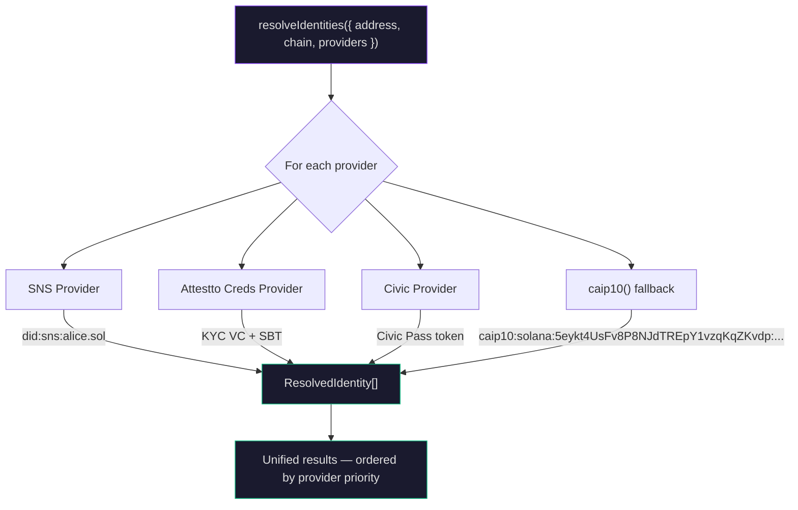
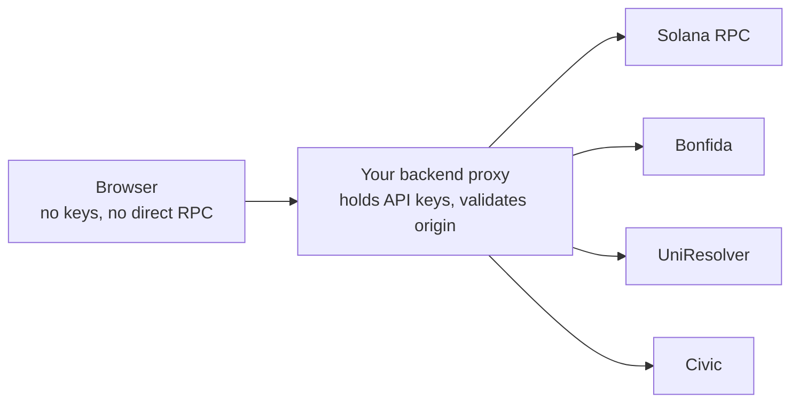

# @attestto/wallet-identity-resolver

[](https://www.npmjs.com/package/@attestto/wallet-identity-resolver)

> Given a wallet address and chain, discover all DIDs, SBTs, attestations, and credentials attached to it. Pluggable providers, pluggable priorities.

`@attestto/wallet-identity-resolver` is the identity middleware that runs after wallet connection. WalletConnect, Phantom, and Wagmi give you an address and a signer — they stop there. `@attestto/wallet-identity-resolver` takes that address and resolves the full identity graph: DIDs (did:sns, did:ens, did:web), SNS/ENS domains, KYC credentials, Civic passes, Soulbound Tokens, vLEI attestations. You pick which providers to trust and in what priority order.

Part of the [Attestto](https://attestto.org) open identity ecosystem.

## Architecture



The consumer (your dApp) decides which identity types to accept and in what priority — no hardcoded assumptions, no hardcoded endpoints.

## Quick start

### Prerequisites

- Node.js 16+
- A wallet address to resolve
- At least one identity provider configured

### Install

```bash
# Core engine (required)
npm install @attestto/wallet-identity-resolver

# Provider plugins (install only what you need)
npm install @attestto/wir-sns        # SNS .sol domains → did:sns
npm install @attestto/wir-ens        # ENS .eth domains → did:ens
npm install @attestto/wir-attestto-creds  # Attestto KYC VCs + SBTs
npm install @attestto/wir-civic      # Civic Pass gateway tokens
npm install @attestto/wir-sas        # Solana Attestation Service
```

### Try it

```ts
import { resolveIdentities } from '@attestto/wallet-identity-resolver'
import { sns } from '@attestto/wir-sns'
import { attesttoCreds } from '@attestto/wir-attestto-creds'
import { civic } from '@attestto/wir-civic'
import { caip10 } from '@attestto/wallet-identity-resolver'

const identities = await resolveIdentities({
  chain: 'solana',
  address: 'ATTEstto1234567890abcdef...',
  providers: [
    attesttoCreds({ programId: '...', rpcUrl: '...' }),
    sns({ apiUrl: '...', resolverUrl: '...' }),
    civic({ apiUrl: '...' }),
    caip10(),  // Fallback — always resolves
  ],
})

// identities: ResolvedIdentity[]
// Each entry: { provider, did, label, type, meta }
```

The engine tries each provider in order. If one finds results, you get those (plus caip10 fallback). If none find anything, you still get a caip10 result that's valid for any address on any chain.

### Monorepo packages

```
packages/
  core/           → @attestto/wallet-identity-resolver  (engine + caip10 fallback)
  sns/            → @attestto/wir-sns                  (SNS .sol domains → did:sns)
  ens/            → @attestto/wir-ens                  (ENS .eth domains → did:ens)
  attestto-creds/ → @attestto/wir-attestto-creds       (KYC, SBTs, VCs)
  civic/          → @attestto/wir-civic                (Civic Pass gateway tokens)
  sas/            → @attestto/wir-sas                  (Solana Attestation Service)
```

## What this is

### Identity Middleware — not a wallet connector

WalletConnect, Dynamic, and Wagmi are **crypto wallet connectors**. They connect MetaMask, Phantom, and Ledger to dApps for **transaction signing**. Once connected, they give you an address and a signer. That's where they stop.

This package is the **identity layer that comes after**. It's DNS for compliance — given a wallet address, it resolves the full identity graph attached to it: DIDs, domains, KYC credentials, institutional attestations, soulbound tokens.

### Why this matters

A traditional bank operating under SWIFT/ISO 20022 cannot interact with a DeFi protocol using WalletConnect alone. Before allowing the transaction, the protocol needs to **resolve** the bank's `did:web` or vLEI credential to verify institutional identity and compliance status. No existing wallet connector does this.

<table>
<tr>
<td width="60" align="center"><strong>Step</strong></td>
<td width="280"><strong>Layer</strong></td>
<td width="60" align="center"><strong>Role</strong></td>
<td><strong>Output</strong></td>
</tr>
<tr>
<td align="center">1</td>
<td>WalletConnect / Phantom</td>
<td align="center">🔌</td>
<td>Address + signer</td>
</tr>
<tr>
<td align="center">2</td>
<td><strong><a href="https://github.com/Attestto-com/identity-resolver">identity-resolver</a></strong></td>
<td align="center">🔍</td>
<td>DIDs, KYC status, vLEI, SBTs, domains</td>
</tr>
<tr>
<td align="center">3</td>
<td><a href="https://github.com/Attestto-com/id-wallet-adapter">id-wallet-adapter</a></td>
<td align="center">🛡️</td>
<td>VP request + cryptographic verification</td>
</tr>
<tr>
<td colspan="4" align="center"><em>Existing connectors handle step 1. Steps 2–3 are the identity middleware that crypto wallets are missing.</em></td>
</tr>
</table>

### What you get vs. what exists

<table>
<tr>
<th width="160"></th>
<th width="320">WalletConnect / Dynamic / Wagmi</th>
<th width="320">identity-resolver</th>
</tr>
<tr>
<td><strong>Purpose</strong></td>
<td>Connect wallet, sign transactions</td>
<td>Resolve identities from an address</td>
</tr>
<tr>
<td><strong>Input</strong></td>
<td>User action (QR scan, click)</td>
<td>Wallet address (string)</td>
</tr>
<tr>
<td><strong>Output</strong></td>
<td>Signer + address</td>
<td>DID Documents, linked identities (<code>alsoKnownAs</code>), KYC status, institutional credentials</td>
</tr>
<tr>
<td><strong>When</strong></td>
<td>Before any interaction</td>
<td>After wallet connection</td>
</tr>
<tr>
<td><strong>Compliance</strong></td>
<td>None — no identity awareness</td>
<td>FATF Travel Rule, eIDAS 2.0, GLEIF vLEI ready</td>
</tr>
</table>

### The full stack

1. **WalletConnect** → connect Solana/Ethereum wallet → get address
2. **identity-resolver** → resolve that address → find SNS domain, Attestto credentials, Civic pass, vLEI attestation
3. **[id-wallet-adapter](https://github.com/Attestto-com/id-wallet-adapter)** → discover credential wallet extensions → request Verifiable Presentation → verify cryptographically

Step 1 uses existing connectors. Steps 2–3 are what we built — the identity middleware that MetaMask, Phantom, and every crypto wallet are currently missing. By following W3C CHAPI and DIDComm v2 standards, this stack is already compatible with the regulatory direction of eIDAS 2.0 (EU), FATF Travel Rule, and jurisdictional digital identity wallet mandates.

### How this relates to existing tools

Several projects resolve partial identity data from addresses. None offer a pluggable, multi-chain resolution engine.

<table>
<tr>
<th width="200">Project</th>
<th width="280">What it does</th>
<th>What it doesn't do</th>
</tr>
<tr>
<td><a href="https://www.npmjs.com/package/@talismn/on-chain-id">@talismn/on-chain-id</a></td>
<td>Resolves ENS (Ethereum) and Polkadot on-chain identity for addresses</td>
<td>No Solana. No pluggable provider architecture. No DID resolution, KYC, vLEI, or SBT support.</td>
</tr>
<tr>
<td><a href="https://www.npmjs.com/package/@onchain-id/identity-sdk">@onchain-id/identity-sdk</a></td>
<td>ERC734/735 identity smart contracts (Ethereum)</td>
<td>Ethereum-only. Contract-level SDK, not a resolver. Last published 2+ years ago.</td>
</tr>
<tr>
<td>DID-native VC toolkits</td>
<td>Issue and verify VCs. Resolve DIDs via <code>did:web</code>, <code>did:key</code>, etc.</td>
<td>Resolve a single DID — do not discover <em>all</em> identities attached to an address. No provider plugin system.</td>
</tr>
<tr>
<td><a href="https://github.com/openwallet-foundation/credo-ts">Credo-ts</a></td>
<td>Full DIDComm + OID4VP agent framework with DID resolution</td>
<td>Agent framework, not an address-to-identity resolver. Requires running a full agent.</td>
</tr>
<tr>
<td><a href="https://github.com/digitalbazaar/vc">@digitalbazaar/vc</a></td>
<td>W3C VC issuance and verification (JSON-LD)</td>
<td>VC operations only. No address-to-identity discovery.</td>
</tr>
</table>

**Where identity-resolver fits:** Given a wallet address, no existing package answers "what DIDs, KYC credentials, vLEI attestations, SBTs, and domains are attached to this address?" across multiple chains. identity-resolver is the only pluggable engine where you pick your providers, set their priority, and get a unified `ResolvedIdentity[]` back — with per-provider timeouts, cancellation, and zero hardcoded endpoints.

## API / Key concepts

### `resolveIdentities(options): Promise<ResolvedIdentity[]>`

Core function that discovers all identities attached to a wallet address.

```ts
interface ResolveOptions {
  chain: Chain                    // 'solana', 'ethereum', or custom
  address: string                 // Wallet address / public key
  providers: IdentityProvider[]   // Ordered list — defines priority
  rpcUrl?: string                 // Global RPC override (passed to providers)
  timeoutMs?: number              // Per-provider timeout (default 5000ms)
  stopOnFirst?: boolean           // Stop after first provider returns results
  signal?: AbortSignal            // Cancellation
}
```

### `ResolvedIdentity`

Result from a single provider:

```ts
interface ResolvedIdentity {
  provider: string                // Which provider found this
  did: string | null              // Resolved DID, if applicable
  label: string                   // Human-readable label
  type: IdentityType              // 'domain' | 'sbt' | 'attestation' | 'credential' | 'did' | 'score'
  meta: Record<string, unknown>   // Provider-specific metadata
}
```

### IdentityProvider interface

Implement this to create a custom identity provider:

```ts
interface IdentityProvider {
  name: string
  chains: string[]  // Which chains you support
  resolve(ctx: ResolveContext): Promise<ResolvedIdentity[]>
}

interface ResolveContext {
  chain: string
  address: string
  rpcUrl?: string
  signal?: AbortSignal
}
```

### Multi-provider fallback chain

Providers are tried in order. Order = priority. The engine guarantees:

1. Try each provider in the order you pass them
2. Collect all results
3. If nothing found, return `caip10()` fallback (valid for any address on any chain)
4. If `stopOnFirst: true`, stop after the first provider that returns results

## Ecosystem

Related repos in the Attestto ecosystem:

| Package | Purpose | Repo |
|---|---|---|
| **@attestto/id-wallet-adapter** | Discover credential wallet extensions, request and verify Verifiable Presentations | [GitHub](https://github.com/Attestto-com/id-wallet-adapter) |
| **@attestto/verify** | Web Components for wallet discovery, signing, and VP verification | [GitHub](https://github.com/Attestto-com/verify) |
| **@attestto/vc-sdk** | Issue and verify W3C Verifiable Credentials | [GitHub](https://github.com/Attestto-com/vc-sdk) |
| **did-sns-spec** | `did:sns` DID method spec — Solana domain to DID resolution | [GitHub](https://github.com/Attestto-com/did-sns-spec) |
| **vLEI-Solana-Bridge** | Write and verify vLEI attestations from GLEIF on Solana | [GitHub](https://github.com/Attestto-com/vLEI-Solana-Bridge) |

## Build with an LLM

This repo ships a [`llms.txt`](./llms.txt) context file — a machine-readable summary of the API, data structures, and integration patterns designed to be read by AI coding assistants.

### Recommended setup

Use the [`attestto-dev-mcp`](../attestto-dev-mcp) server to give your LLM active access to the ecosystem:

```bash
cd ../attestto-dev-mcp
npm install && npm run build
```

Then add it to your Claude / Cursor / Windsurf config and ask:

> *"Explore the Attestto ecosystem and scaffold me an on-chain identity resolver"*

### Which model?

We recommend **[Claude](https://claude.ai) Pro** (5× usage vs free) or higher. Long context and strong TypeScript reasoning handle this codebase well. The MCP server works with any LLM that supports tool use.

> **Quick start:** Ask your LLM to read `llms.txt` in this repo, then describe what you want to build. It will find the right archetype, generate boilerplate, and walk you through the first run.

## Examples

The [DID Landscape Explorer](https://github.com/chongkan/did-landscape-explorer) uses this package in its self-assessment wizard. When a user connects a Web3 wallet, the explorer resolves all identities attached to their address and lets them pick which DID to sign with.

### Ethereum example

```ts
import { resolveIdentities, caip10 } from '@attestto/wallet-identity-resolver'
import { ens } from '@attestto/wir-ens'

const identities = await resolveIdentities({
  chain: 'ethereum',
  address: '0xd8dA6BF26964aF9D7eEd9e03E53415D37aA96045',
  providers: [
    ens({ resolverUrl: 'https://api.yourapp.com/resolver' }),
    caip10(),
  ],
})
```

## Security

**No hardcoded endpoints.** Every provider requires explicit URLs from the consumer. No provider ever makes a network call to an endpoint you didn't configure. See [SECURITY.md](SECURITY.md) for the full security model.

**Recommended architecture:**



## Provider packages reference

| Package | Chain | What it resolves | Required options |
|---|---|---|---|
| `@attestto/wallet-identity-resolver` | any | Core engine + `caip10()` fallback | — |
| `@attestto/wir-sns` | Solana | SNS `.sol` domains → `did:sns` | `apiUrl`, `resolverUrl` |
| `@attestto/wir-ens` | Ethereum | ENS `.eth` domains → `did:ens` | `resolverUrl` |
| `@attestto/wir-attestto-creds` | Solana | Attestto KYC, identity SBTs, VCs | `programId`, `rpcUrl` |
| `@attestto/wir-civic` | Solana | Civic Pass gateway tokens | `apiUrl` |
| `@attestto/wir-sas` | Solana | Solana Attestation Service | `programId`, `rpcUrl` |

## Writing a Custom Provider

Any identity source can become a provider. Follow these steps:

### Step 1 — Define your options

Create an interface for the configuration your provider needs. All network endpoints must be **required** (no hardcoded URLs).

```ts
interface MyProviderOptions {
  /** Your API endpoint — consumer must provide this (required) */
  apiUrl: string
  /** Optional filter */
  category?: string
}
```

### Step 2 — Create the factory function

Export a function that takes your options and returns an `IdentityProvider`. This is the pattern every built-in provider follows.

```ts
import type { IdentityProvider } from 'identity-resolver'

export function myProvider(options: MyProviderOptions): IdentityProvider {
  return {
    name: 'my-provider',    // Unique name — shows up in ResolvedIdentity.provider
    chains: ['solana'],      // Which chains you support (use ['*'] for all chains)
    resolve: async (ctx) => {
      // ... (Step 3)
    },
  }
}
```

### Step 3 — Implement `resolve()`

The engine calls `resolve(ctx)` with the wallet address and chain. Your job:

1. Call your data source (API, RPC, on-chain program)
2. Map results to `ResolvedIdentity[]`
3. Return `[]` if nothing found — **never throw**

```ts
import type { IdentityProvider, ResolveContext, ResolvedIdentity } from 'identity-resolver'

export function myProvider(options: MyProviderOptions): IdentityProvider {
  return {
    name: 'my-provider',
    chains: ['solana'],

    async resolve(ctx: ResolveContext): Promise<ResolvedIdentity[]> {
      // ctx.chain   — 'solana', 'ethereum', etc.
      // ctx.address — the wallet public key / address
      // ctx.rpcUrl  — optional RPC override from the consumer
      // ctx.signal  — AbortSignal for cancellation (pass to fetch!)

      try {
        const res = await fetch(
          `${options.apiUrl}/lookup/${ctx.address}`,
          { signal: ctx.signal },
        )
        if (!res.ok) return []

        const data = await res.json() as { items: Array<{ name: string; did?: string }> }
        if (!data.items?.length) return []

        return data.items.map((item) => ({
          provider: 'my-provider',       // Must match the name above
          did: item.did ?? null,         // DID string, or null if not applicable
          label: item.name,              // Human-readable label for display
          type: 'credential' as const,   // 'domain' | 'sbt' | 'attestation' | 'credential' | 'did' | 'score'
          meta: { raw: item },           // Anything extra — consumers access via meta
        }))
      } catch {
        return []  // Never throw — return empty on failure
      }
    },
  }
}
```

### Step 4 — Use it

Pass your provider to `resolveIdentities` alongside any others. Order = priority.

```ts
import { resolveIdentities, caip10 } from 'identity-resolver'
import { myProvider } from './my-provider'

const identities = await resolveIdentities({
  chain: 'solana',
  address: pubkey,
  providers: [
    myProvider({ apiUrl: 'https://my-backend.com/api/lookup' }),
    caip10(), // always-available fallback
  ],
})
```

### Step 5 (optional) — Publish as a package

To share your provider as an npm package:

1. Name it `@yourorg/wir-<name>` (convention, not required)
2. Add `identity-resolver` as a **peer dependency** for type compatibility
3. Export your factory function + options interface

```json
{
  "name": "@yourorg/wir-my-provider",
  "peerDependencies": {
    "identity-resolver": "^0.1.0"
  }
}
```

### Provider Rules

<table>
<tr>
<th width="240">Rule</th>
<th>Why</th>
</tr>
<tr>
<td><strong>No hardcoded URLs</strong></td>
<td>Consumer controls infrastructure, keys, CORS</td>
</tr>
<tr>
<td><strong>Never throw from <code>resolve()</code></strong></td>
<td>One broken provider must not crash the chain</td>
</tr>
<tr>
<td><strong>Return <code>[]</code> on failure</strong></td>
<td>Empty = nothing found, engine moves on</td>
</tr>
<tr>
<td><strong>Pass <code>ctx.signal</code> to fetch</strong></td>
<td>Supports cancellation and timeouts</td>
</tr>
<tr>
<td><strong>Use <code>meta</code> for extras</strong></td>
<td>Don't extend <code>ResolvedIdentity</code> — put provider-specific data in <code>meta</code></td>
</tr>
<tr>
<td><strong>One provider = one source</strong></td>
<td>Keep providers focused (SNS, Civic, etc.)</td>
</tr>
</table>

## Development

```bash
pnpm install
pnpm run build    # Build all packages
pnpm run lint     # Type-check all packages
```

## Contributing

See [CONTRIBUTING.md](CONTRIBUTING.md).

## License

MIT
